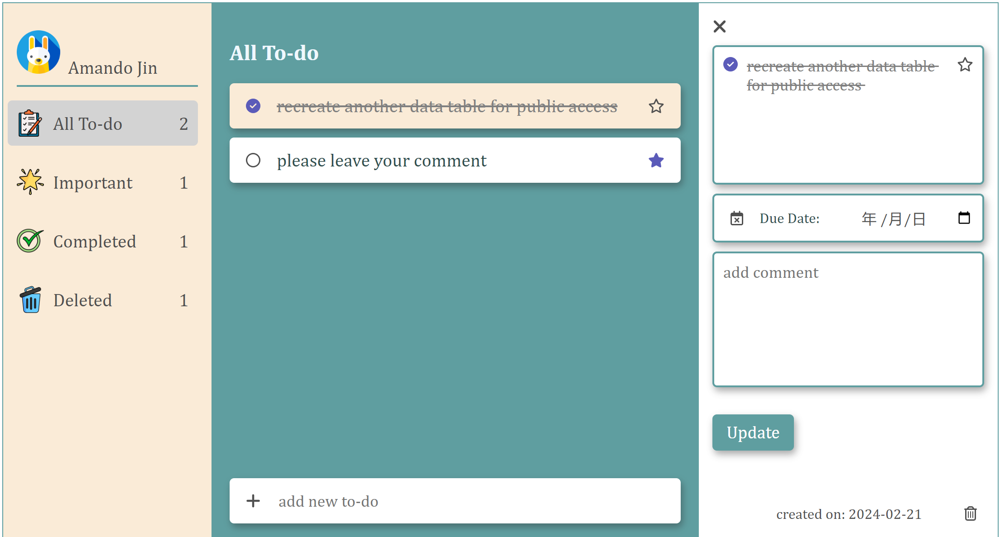

#  Edmond Jin's To-do List 
## Introduction:  
It's an assignment of **SWEN504 Web Apps** with a development duration of 3 days.  
Used HTML, JavaScript, CSS, php, SQL  
Deployed through XAMPP (Apache + MySQL) on a local server  
[Visit the web app on my private cloud](http://anmeng.link:4080)

## Snapshoot

## Features
- real-time synchronization with database
- asynchronous webpage updates using AJAX
- smooth animation
- responsive: hamburger menu, layout adjust 

## Tools and Technologies Used: 
| Type | Name |
| ----------- | ----------- |
| Front End  | HTML/JavaScript/CSS |
| Back End   | php 
| Database   | MySQL |
| Web Server | Apache |
| Database Client | phpMyAdmin |
| Editor/IDE | VS Code/phpStorm |

## Installation
- **Requirement**:  
XAMPP installed (Apache + MySQL)  

- **Steps:**
1. copy the source code to the XAMPP/htdoc
2. import the *edmond_todo_list.sql* to phpmyAdmin
3. run the *todo_index.php* through XAMPP control panel

## License
MIT